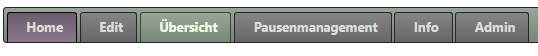
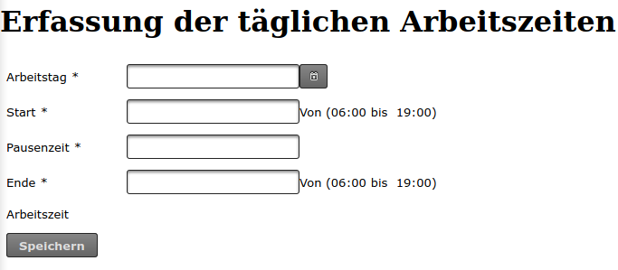
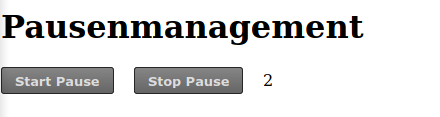

# Arbeitszeiterfassung
Einfache Applikation zum Nachverfolgen seiner eigenen Arbeitszeit. In Zeiten von HomeOffice kann dies einfach nebenbei auf einem kleinen Server installiert werden. Die Applikation hat intern eine kleine Derby Datenbank integriert.

## Eingabe der Stunden

Über die Auswahl des Tages kann Start, Pause und Ende der Arbeitszeit eingetragen werden.  Die Berechnung der Nettoarbeitszeit erfolgt dann auf Minuten Basis

## Berichtsübersicht

Der aktuelle Monat ist beim Öffnen des Tabs direkt Sichtbar, es können die letzten drei Monate als Bericht angezeigt werden.

## Pausenmanagment

Die Applikation hat ein kleine Möglichkeit per Start und Stop die genutzte Pausenzeit in Minuten anzuzeigen.

## Einfaches Starten der Applikation

Für die developer variante wird der Port 8888 verwendet und kann wie folgt gestartet werden:
java -jar -Dspring.profiles.active=dev arbeitszeiterfassung-1.0-SNAPSHOT.war

Für die Produktive variante wird der Port 9002 verwendet und kann wie folgt gestartet werden:
java -jar -Dspring.profiles.active=prod arbeitszeiterfassung-1.0-SNAPSHOT.war

