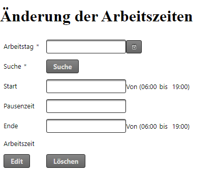

# Arbeitszeiterfassung

Einfache Applikation zum Nachverfolgen seiner eigenen Arbeitszeit. In Zeiten von HomeOffice kann dies einfach nebenbei auf einem kleinen Server installiert werden. Die Applikation hat intern eine kleine Derby Datenbank integriert.

## Anforderungen Server

* Alpine Linux v3.12
* OpenJDK Version 11
* 512MB RAM

## Anforderungen für Entwicklung

* Apache Maven 3.6.3
* git version 2.28.0.windows.1
* openjdk version "13" 2019-09-17
* Java IDE like IntelliJ

### Entwicklung

* git clone https://github.com/Gichinsan/arbeitszeiterfassung.git
* mvnw clean install
* cd target  
* scp arbeitszeiterfassung-1.0-SNAPSHOT.war **<destination-server>**

## Einfaches Starten der Applikation

Für die **Developer** -variante wird der Port 8888 verwendet und kann wie folgt gestartet werden:

`java -jar -Dspring.profiles.active=dev arbeitszeiterfassung-1.0-SNAPSHOT.war`

Für die **Produktive** -variante wird der Port 9002 verwendet und kann wie folgt gestartet werden:

`java -jar -Dspring.profiles.active=prod arbeitszeiterfassung-1.0-SNAPSHOT.war`

## Applikations-Dokumentation

### Home

Über die Auswahl des Tages kann Start, Pause und Ende der Arbeitszeit eingetragen werden.  Die Berechnung der Nettoarbeitszeit erfolgt dann auf Minuten Basis

### Edit

Über eine spzielle Admin-Rolle können schon eingegebene Daten noch einmal verändert werden.

* _Rollenkonzept wurde bisher noch nicht implementiert_

### Übersicht

Der aktuelle Monat ist beim Öffnen des Tabs direkt Sichtbar, es können die letzten drei Monate als Bericht angezeigt werden.
Am unteren Ende des Berichts wird die IST-Zeit und SOLL-Zeit angezeigt. Die Daten stammen aus dem Stammdaten im Admin bereich.

Zur korrekten Berechung der Arbeitstage wird noch eine andere Applikation zur Berechung der Feiertage und der Monatlichen Arbeitstage benötigt.

### Pausenmanagment

Die Applikation hat ein kleine Möglichkeit per Start und Stop die genutzte Pausenzeit in Minuten anzuzeigen.

### Admin

Im Adminbereich kann der Name und die Arbeitszeiten, Maximale Arbeitszeit und Wöchentliche Arbeitszeit in Stunden eingetragen werden.
Diese Daten werden beim erstellen des Berichts mit Berücksichtigt.

